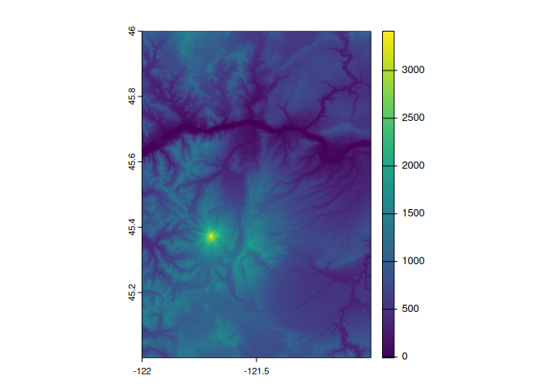

<!-- README.md is generated from README.Rmd. Please edit that file -->

<br>

</a>

# demsrc

<!-- badges: start -->

[](https://github.com/Permian-Global-Research/demsrc/actions/workflows/R-CMD-check.yaml)
<!-- badges: end -->

The goal of demsrc is to return the remote url sources for global DEM
products. For now, the only main function is `mpc_dtm_src` which
accesses the collections via the [Microsoft Planetary Computer STAC
catalog](https://planetarycomputer.microsoft.com/catalog) using the
[{rstac} package](https://brazil-data-cube.github.io/rstac/)

## Installation

You can install the development version of demsrc from
[GitHub](https://github.com/) with:

``` r
# install.packages("devtools")
devtools::install_github("Permian-Global-Research/demsrc")
```

## Example

Return the URLs for the desired DEM collection.

``` r
library(demsrc)
library(terra)
#> terra 1.6.51


(mh <- mpc_dtm_src(c( -121.772, 45.321, -121.611, 45.419), 
                   collection = "alos-dem"))
#> [1] "/vsicurl/https://ai4edataeuwest.blob.core.windows.net/alos-dem/AW3D30_global/ALPSMLC30_N045W122_DSM.tif"

plot(rast(mh))
```



``` r
library(sf)
#> Linking to GEOS 3.10.2, GDAL 3.4.3, PROJ 8.2.1; sf_use_s2() is TRUE

nc_sf <- system.file("gpkg", "nc.gpkg", package = "sf") |>
  read_sf()


mpc_dtm_src(nc_sf, collection = "alos-dem")
#>  [1] "/vsicurl/https://ai4edataeuwest.blob.core.windows.net/alos-dem/AW3D30_global/ALPSMLC30_N036W085_DSM.tif"
#>  [2] "/vsicurl/https://ai4edataeuwest.blob.core.windows.net/alos-dem/AW3D30_global/ALPSMLC30_N036W084_DSM.tif"
#>  [3] "/vsicurl/https://ai4edataeuwest.blob.core.windows.net/alos-dem/AW3D30_global/ALPSMLC30_N036W083_DSM.tif"
#>  [4] "/vsicurl/https://ai4edataeuwest.blob.core.windows.net/alos-dem/AW3D30_global/ALPSMLC30_N036W082_DSM.tif"
#>  [5] "/vsicurl/https://ai4edataeuwest.blob.core.windows.net/alos-dem/AW3D30_global/ALPSMLC30_N036W081_DSM.tif"
#>  [6] "/vsicurl/https://ai4edataeuwest.blob.core.windows.net/alos-dem/AW3D30_global/ALPSMLC30_N036W080_DSM.tif"
#>  [7] "/vsicurl/https://ai4edataeuwest.blob.core.windows.net/alos-dem/AW3D30_global/ALPSMLC30_N036W079_DSM.tif"
#>  [8] "/vsicurl/https://ai4edataeuwest.blob.core.windows.net/alos-dem/AW3D30_global/ALPSMLC30_N036W078_DSM.tif"
#>  [9] "/vsicurl/https://ai4edataeuwest.blob.core.windows.net/alos-dem/AW3D30_global/ALPSMLC30_N036W077_DSM.tif"
#> [10] "/vsicurl/https://ai4edataeuwest.blob.core.windows.net/alos-dem/AW3D30_global/ALPSMLC30_N036W076_DSM.tif"
#> [11] "/vsicurl/https://ai4edataeuwest.blob.core.windows.net/alos-dem/AW3D30_global/ALPSMLC30_N035W085_DSM.tif"
#> [12] "/vsicurl/https://ai4edataeuwest.blob.core.windows.net/alos-dem/AW3D30_global/ALPSMLC30_N035W084_DSM.tif"
#> [13] "/vsicurl/https://ai4edataeuwest.blob.core.windows.net/alos-dem/AW3D30_global/ALPSMLC30_N035W083_DSM.tif"
#> [14] "/vsicurl/https://ai4edataeuwest.blob.core.windows.net/alos-dem/AW3D30_global/ALPSMLC30_N035W082_DSM.tif"
#> [15] "/vsicurl/https://ai4edataeuwest.blob.core.windows.net/alos-dem/AW3D30_global/ALPSMLC30_N035W081_DSM.tif"
#> [16] "/vsicurl/https://ai4edataeuwest.blob.core.windows.net/alos-dem/AW3D30_global/ALPSMLC30_N035W080_DSM.tif"
#> [17] "/vsicurl/https://ai4edataeuwest.blob.core.windows.net/alos-dem/AW3D30_global/ALPSMLC30_N035W079_DSM.tif"
#> [18] "/vsicurl/https://ai4edataeuwest.blob.core.windows.net/alos-dem/AW3D30_global/ALPSMLC30_N035W078_DSM.tif"
#> [19] "/vsicurl/https://ai4edataeuwest.blob.core.windows.net/alos-dem/AW3D30_global/ALPSMLC30_N035W077_DSM.tif"
#> [20] "/vsicurl/https://ai4edataeuwest.blob.core.windows.net/alos-dem/AW3D30_global/ALPSMLC30_N035W076_DSM.tif"
#> [21] "/vsicurl/https://ai4edataeuwest.blob.core.windows.net/alos-dem/AW3D30_global/ALPSMLC30_N034W085_DSM.tif"
#> [22] "/vsicurl/https://ai4edataeuwest.blob.core.windows.net/alos-dem/AW3D30_global/ALPSMLC30_N034W084_DSM.tif"
#> [23] "/vsicurl/https://ai4edataeuwest.blob.core.windows.net/alos-dem/AW3D30_global/ALPSMLC30_N034W083_DSM.tif"
#> [24] "/vsicurl/https://ai4edataeuwest.blob.core.windows.net/alos-dem/AW3D30_global/ALPSMLC30_N034W082_DSM.tif"
#> [25] "/vsicurl/https://ai4edataeuwest.blob.core.windows.net/alos-dem/AW3D30_global/ALPSMLC30_N034W081_DSM.tif"
#> [26] "/vsicurl/https://ai4edataeuwest.blob.core.windows.net/alos-dem/AW3D30_global/ALPSMLC30_N034W080_DSM.tif"
#> [27] "/vsicurl/https://ai4edataeuwest.blob.core.windows.net/alos-dem/AW3D30_global/ALPSMLC30_N034W079_DSM.tif"
#> [28] "/vsicurl/https://ai4edataeuwest.blob.core.windows.net/alos-dem/AW3D30_global/ALPSMLC30_N034W078_DSM.tif"
#> [29] "/vsicurl/https://ai4edataeuwest.blob.core.windows.net/alos-dem/AW3D30_global/ALPSMLC30_N034W077_DSM.tif"
#> [30] "/vsicurl/https://ai4edataeuwest.blob.core.windows.net/alos-dem/AW3D30_global/ALPSMLC30_N033W085_DSM.tif"
#> [31] "/vsicurl/https://ai4edataeuwest.blob.core.windows.net/alos-dem/AW3D30_global/ALPSMLC30_N033W084_DSM.tif"
#> [32] "/vsicurl/https://ai4edataeuwest.blob.core.windows.net/alos-dem/AW3D30_global/ALPSMLC30_N033W083_DSM.tif"
#> [33] "/vsicurl/https://ai4edataeuwest.blob.core.windows.net/alos-dem/AW3D30_global/ALPSMLC30_N033W082_DSM.tif"
#> [34] "/vsicurl/https://ai4edataeuwest.blob.core.windows.net/alos-dem/AW3D30_global/ALPSMLC30_N033W081_DSM.tif"
#> [35] "/vsicurl/https://ai4edataeuwest.blob.core.windows.net/alos-dem/AW3D30_global/ALPSMLC30_N033W080_DSM.tif"
#> [36] "/vsicurl/https://ai4edataeuwest.blob.core.windows.net/alos-dem/AW3D30_global/ALPSMLC30_N033W079_DSM.tif"
#> [37] "/vsicurl/https://ai4edataeuwest.blob.core.windows.net/alos-dem/AW3D30_global/ALPSMLC30_N033W078_DSM.tif"
```
